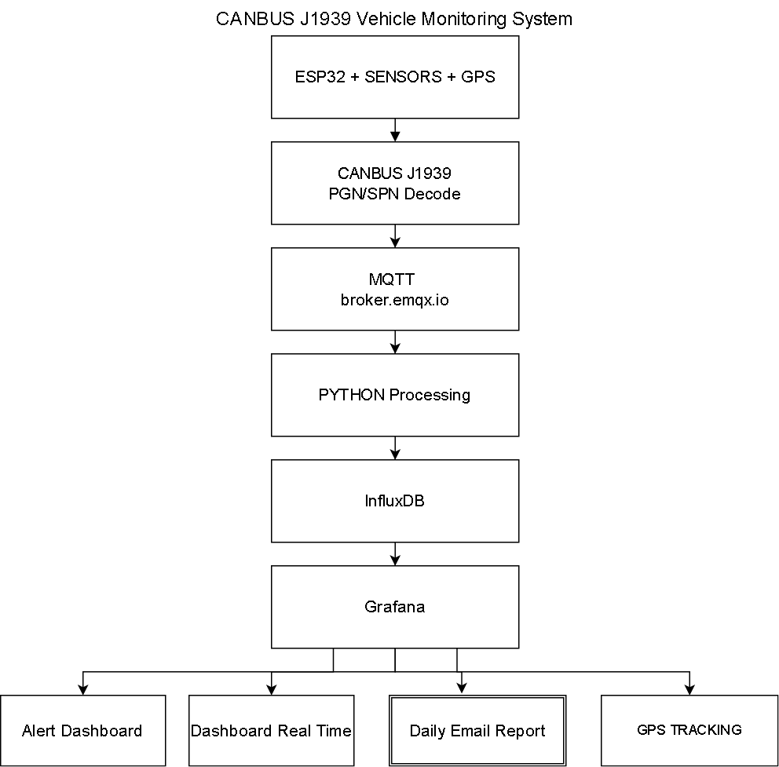
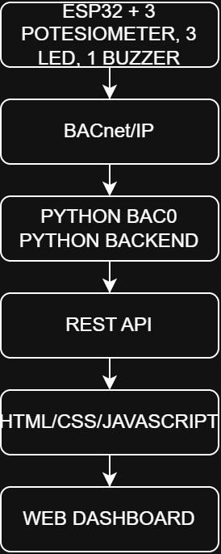
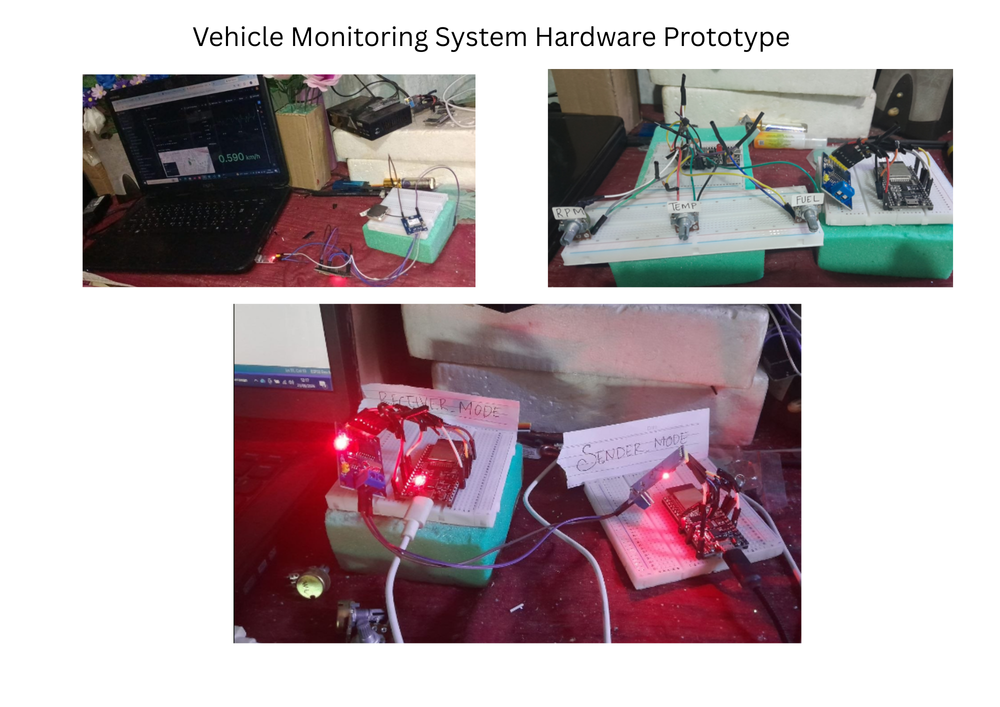
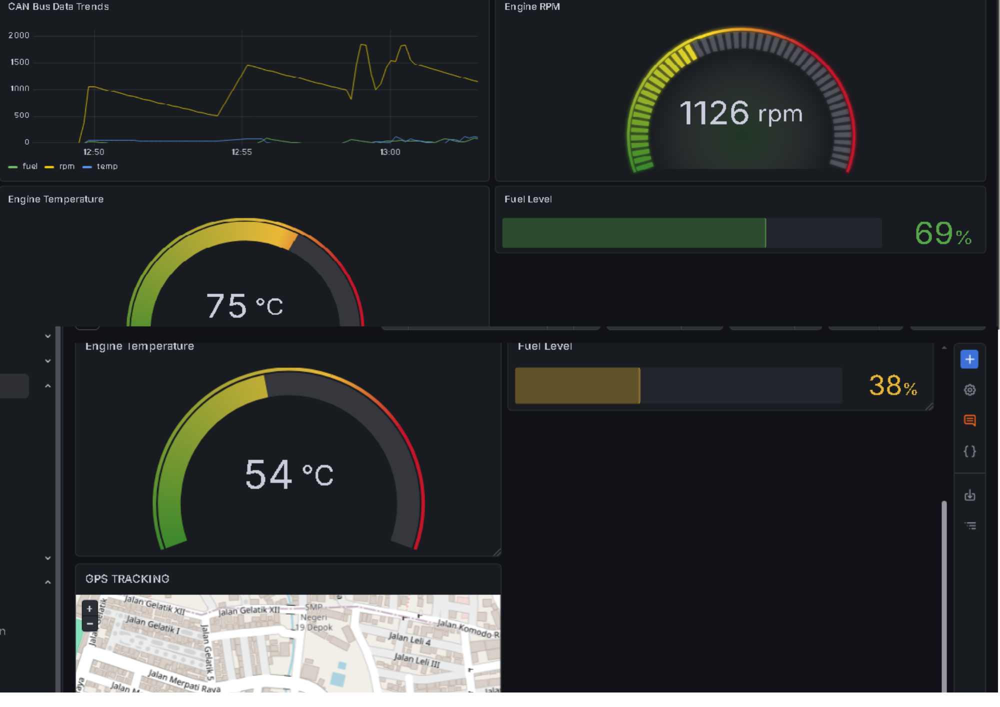
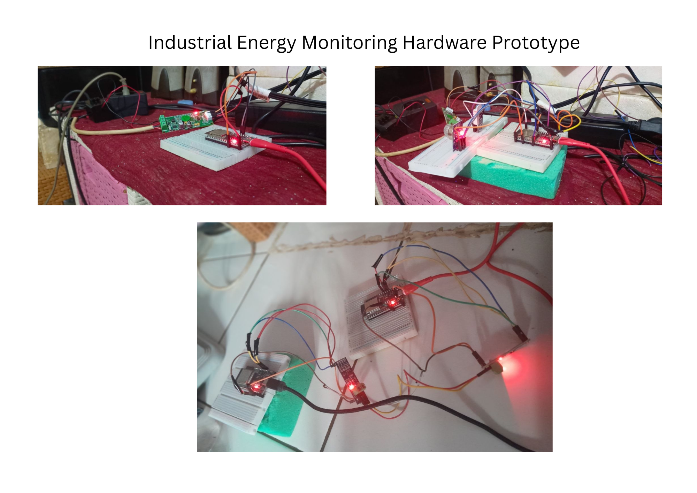
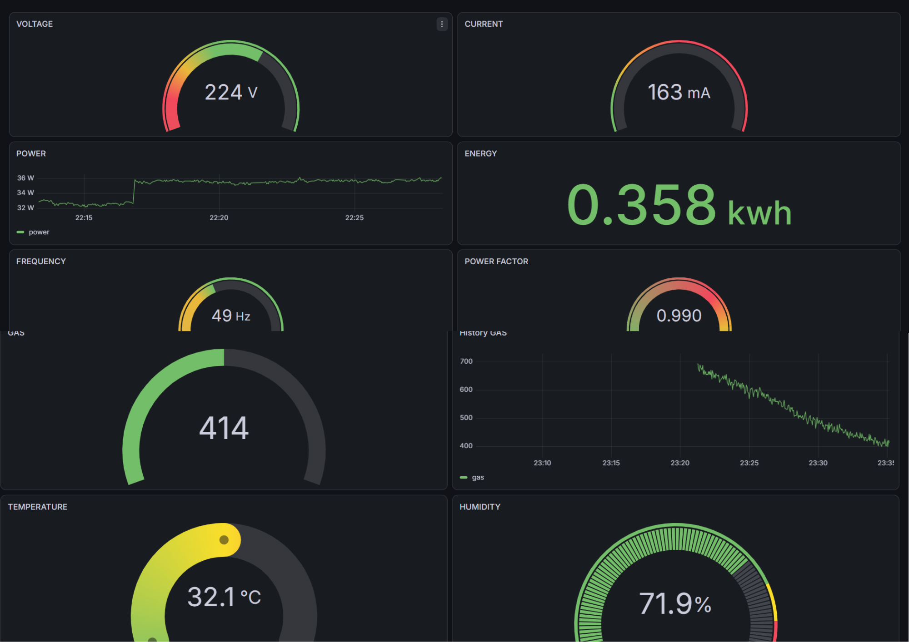

# Industrial IoT & Embedded Systems Engineer Portfolio

Hands-on Industrial IoT projects built using ESP32, CAN Bus J1939, Modbus RTU, MQTT, Python, Grafana, and REST API. This portfolio showcases complete end-to-end monitoring systems from embedded devices to cloud dashboards.

---

# About Me

I build practical Industrial IoT and Embedded Systems projects to strengthen my engineering skills.

My work focuses on designing complete monitoring systems, starting from embedded devices, industrial communication protocols, cloud data processing, dashboards, and REST API integration.

This portfolio demonstrates how sensor data is collected, transmitted, stored, visualized, and exposed through REST APIs using real Industrial IoT technologies.

## Vehicle Monitoring System Architecture

## Industrial Energy Monitoring System Architecture

## Smart Building Automation System Architecture

### BACnet/IP Architecture

### Modbus RTU Architecture

My projects cover every layer of an Industrial IoT architecture, including:

- ESP32 Embedded Systems
- CAN Bus SAE J1939
- Modbus RTU (RS485)
- MQTT Communication
- Python Backend
- EMQX Cloud
- InfluxDB Cloud
- Grafana Dashboard
- Flask REST API
- ngrok API Deployment

I enjoy designing reliable monitoring systems that integrate sensors, industrial protocols, cloud platforms, databases, dashboards, and web APIs into one complete solution.

---

# Skills

### Embedded Systems
- ESP32
- Arduino IDE

### Industrial Protocols
- CAN Bus SAE J1939
- Modbus RTU (RS485)

### Communication
- MQTT
- MQTT TLS

### Backend
- Python
- Flask REST API

### Database
- InfluxDB Cloud

### Visualization
- Grafana

### Cloud
- EMQX Cloud

### Version Control
- Git
- GitHub
---

# Project 1

# Vehicle Monitoring System (CAN Bus SAE J1939)

## Overview

An end-to-end vehicle telematics monitoring system developed using ESP32 and CAN Bus SAE J1939.

The system reads vehicle parameters, publishes data through MQTT, stores data in InfluxDB Cloud, visualizes information in Grafana, and provides real-time alerts via Telegram.

## Features

- CAN Bus SAE J1939 Communication
- Real-Time Vehicle Monitoring
- MQTT Communication
- Python Data Processing
- InfluxDB Cloud Storage
- Grafana Dashboard
- Telegram Alert
- Daily Email Report
- GPS Tracking

## Technologies

- ESP32
- MCP2515
- CAN Bus SAE J1939
- MQTT
- Python
- InfluxDB Cloud
- Grafana
- Telegram Bot
- GPS Module

  ## Hardware Prototype

  ## Grafana Dashboard

---

# Project 2

# Industrial Energy Monitoring System (Modbus RTU)

## Overview

An Industrial IoT monitoring system for electrical energy monitoring using Modbus RTU over RS485.

The system collects electrical parameters from PZEM-004T sensors, transmits data through MQTT TLS to EMQX Cloud, stores measurements in InfluxDB Cloud, visualizes dashboards in Grafana, and exposes data through a Flask REST API.

## Features

- Electrical Energy Monitoring
- Modbus RTU Data Acquisition
- RS485 Multi-Device Communication
- Secure MQTT TLS Communication
- Cloud Data Storage
- Real-Time Dashboard
- REST API Integration
- Remote API Access via ngrok

## Technologies

- ESP32
- PZEM-004T
- RS485
- Modbus RTU
- MQTT TLS
- EMQX Cloud
- Python
- Flask REST API
- InfluxDB Cloud
- Grafana

## Hardware Prototype

## Grafana Dashboard

  
---

# System Architecture

## Vehicle Monitoring System

ESP32
→ CAN Bus SAE J1939
→ MQTT
→ Python Subscriber
→ InfluxDB Cloud
→ Grafana Dashboard
→ Telegram Alert
→ Daily Email Report

---

## Industrial Energy Monitoring System

PZEM-004T
→ ESP32 Slave
→ RS485 (Modbus RTU)
→ ESP32 Master
→ MQTT TLS
→ EMQX Cloud
→ Python Backend
→ InfluxDB Cloud
→ Grafana Dashboard
→ Flask REST API
→ ngrok

---

# Repository

## Portfolio PDF

Industrial_IoT_portfolio.pdf

Download the complete Industrial IoT Portfolio (PDF) for detailed project documentation.

---

# Learning Journey

These projects helped me strengthen practical skills in:

- Embedded Systems Development
- Industrial Communication Protocols
- MQTT Communication
- Cloud IoT Platforms
- Time-Series Database
- Dashboard Visualization
- REST API Development
- Industrial System Integration

---

# Contact

GitHub:
https://github.com/Marwan-git28

LinkedIn:
(https://www.linkedin.com/in/marwan-saputra-972242415/)

Email:
(projectesp32.mrwn@gmail.com)
{marwan.siputra@gmail.com)

---

Thank you for visiting my portfolio.
